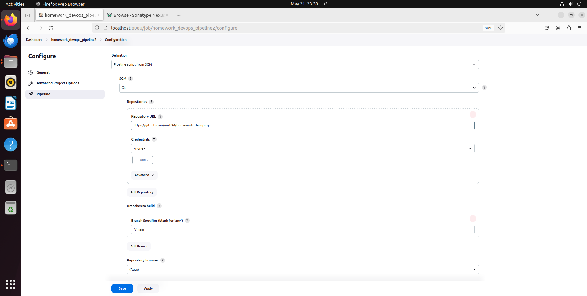

# Домашнее задание к занятию «Что такое DevOps. СI/СD» Zhdanov Artem

### Задание 1

### Задание 2

### Задание 3

- [Дополнительный материал для занятия "8.2. Что такое DevOps. СI/СD"](CICD/8.2-hw.md)

- [Дополнительный материал для занятия "8.3. GitLab"](https://github.com/netology-code/sdvps-materials/tree/main/gitlab)
